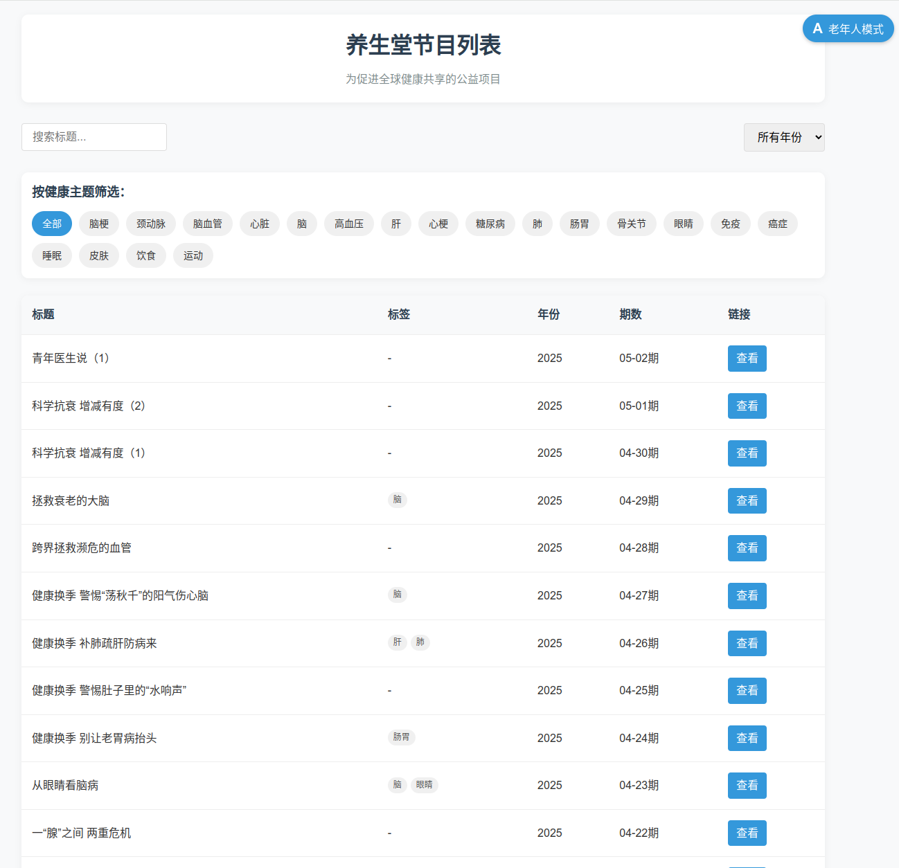

# 全球健康资源列表


这是一个公益项目，旨在促进全球健康信息的共享和传播。
该项目是一个静态网站，展示了来自养生堂数据集的健康相关资源。

[养生堂索引页](https://yangshengtang.vercel.app/)

### 缘起
在使用“养生堂”(by 北京卫视)官方网页时，不能很好的检索，故而做了这个检索页，帮助大众更好地定位到视频。

### 展示




## 功能

- 显示来自 `yst_data` 目录中所有 JSON 文件的健康资源
- 表格呈现，包含标题、标签、年份、期数和链接
- 支持按标题搜索
- 支持按年份筛选
- 支持按健康主题(标签)筛选
- 分页显示，每页30条数据
- 点击资源链接可跳转至对应网页
- 提供老年人友好模式，显示大字体和简化界面

## 近期更新

- 将前端项目移动到独立的`project`目录中，与数据爬取脚本分离
- 优化了标签系统，新增"脑梗"、"颈动脉"、"脑血管"等特定健康主题标签
- 调整了表格列顺序，更加符合阅读习惯
- 按年份降序排列，最新内容优先显示
- 添加分页功能，提高浏览体验
- 添加了老年人友好模式，专为老年用户设计
- 添加了服务器脚本，支持快速部署

## todo
* with help of AI, extract the info from video to make this site more user friendly.
* update data daily

## 技术栈

- HTML5
- CSS3
- JavaScript (ES6+)
- Node.js (用于生产环境部署)

## 项目结构

```
/
├── project/              # 前端项目目录
│   ├── index.html        # 主页面
│   ├── styles.css        # 样式表
│   ├── script.js         # JavaScript 脚本
│   ├── server.js         # Node.js服务器脚本
│   └── package.json      # 项目配置文件
├── yst_data/             # 数据目录
│   ├── yst_2018.json     # 2018年数据
│   ├── yst_2019.json     # 2019年数据
│   └── ...               # 其他年份数据
├── start.sh              # 启动脚本
├── README.md             # 项目说明 
├── scrape_basic_info.py  # 数据爬取脚本
└── scrape_video_link.py  # 视频链接爬取脚本
```

## 如何使用

### 本地测试
0. 安装环境
> conda create -n yst python=3.12
> conda activate yst
> pip install -r requirements.txt
> playwright install

更新数据
> python update_yst_data.py 

1. 运行启动脚本启动服务器：
   ```
   ./start.sh
   ```
   或者手动运行：
   ```
   cd project
   node server.js
   ```

2. 在浏览器中访问：
   ```
   http://localhost:8081
   ```

3. 使用搜索框可根据标题搜索资源
4. 使用年份下拉菜单可筛选特定年份的内容
5. 点击标签可以筛选特定健康主题的内容
6. 使用分页按钮查看更多内容
7. 点击右上角的"老年人模式"按钮切换至老年人友好界面

### 部署到服务器

#### 方法一: 使用Node.js (推荐)

1. 确保服务器已安装 Node.js
2. 将整个项目上传到服务器
3. 在服务器上运行启动脚本：
   ```
   ./start.sh
   ```
4. 现在可以通过 `http://服务器IP:8081` 访问网站

#### 方法二: 使用现有Web服务器 (Apache/Nginx)

1. 将project目录中的静态文件（HTML/CSS/JS）上传到Web服务器的根目录或子目录
2. 确保yst_data目录能被正确访问
3. 配置Web服务器指向上传的目录
4. 通过配置的URL访问网站

#### stop the server

> lsof -i :8081
> kill -9 <pid>


## 数据来源

项目使用 `yst_data` 目录中的 JSON 文件作为数据来源，这些文件包含了养生堂官网2018年至今的健康相关资源。

## 贡献

欢迎对项目进行改进和扩展，以更好地促进全球健康信息的传播。

## 许可

本项目为公益性质，鼓励自由分享和使用。

但请遵守养生堂节目的许可协议，本项目对使用者违反养生堂版权的行为不负责任。

## 致敬

To my dearest mother. 祝愿妈妈身体健康！